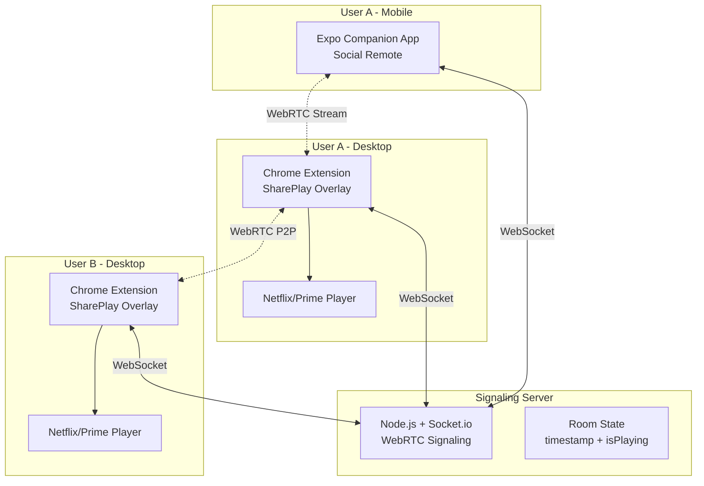
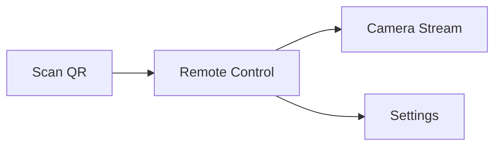
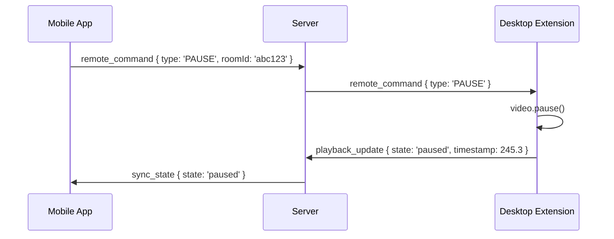
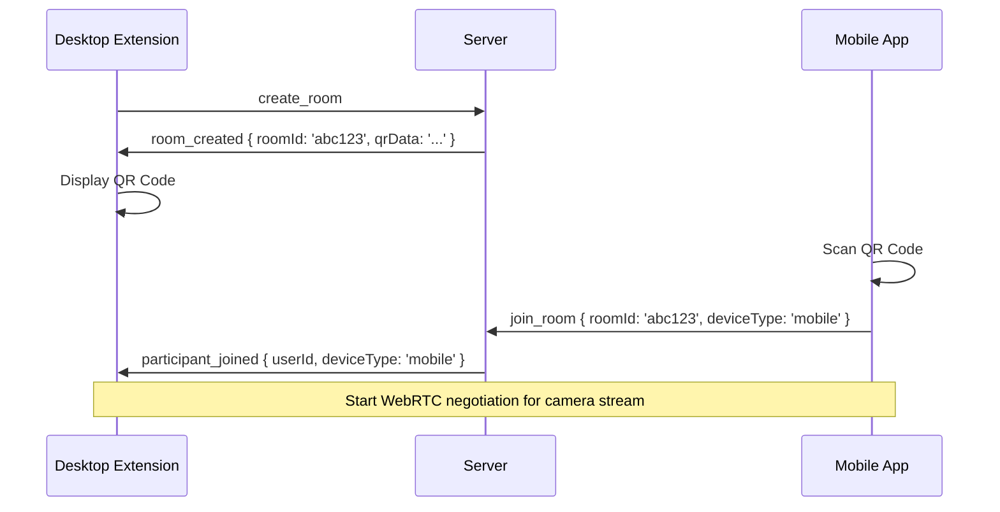
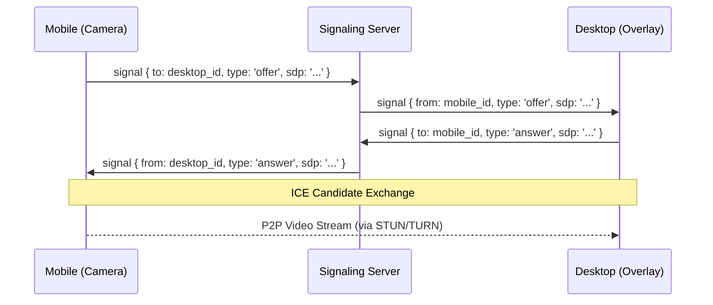
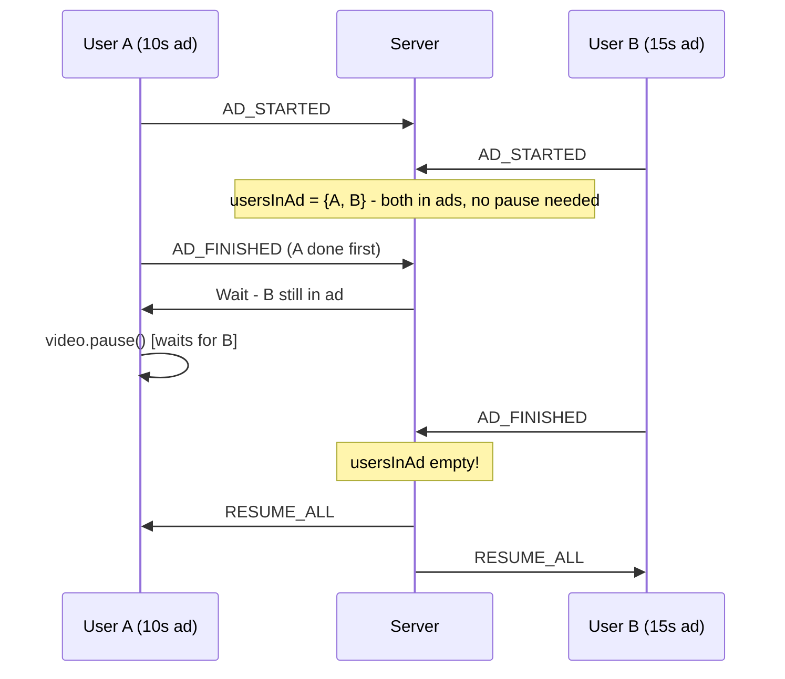

# AirView - Architecture Document

## 1. Executive Overview

**AirView** (codename: AirWatch) is a Universal Cross-Platform Co-Viewing Ecosystem built on the **"Bring Your Own Login" (BYOL)** philosophy. We synchronize playback control signals—not copyrighted content—between users who are authenticated on their own premium streaming accounts.



---

## 2. Monorepo Structure

```
coview/
├── turbo.json                    # Turborepo configuration
├── package.json                  # Root workspace config
├── packages/
│   ├── extension/                # Plasmo browser extension
│   │   ├── src/
│   │   │   ├── background/       # Service worker (Manifest V3)
│   │   │   │   └── index.ts
│   │   │   ├── contents/         # Content scripts
│   │   │   │   ├── netflix.ts    # Netflix-specific video bridge
│   │   │   │   ├── prime.ts      # Prime Video bridge
│   │   │   │   └── overlay.tsx   # Shadow DOM overlay injection
│   │   │   ├── components/       # React components
│   │   │   │   ├── VideoChat/    # Floating video bubbles
│   │   │   │   ├── Controls/     # Sync controls
│   │   │   │   └── QRCode/       # Room QR display
│   │   │   ├── lib/
│   │   │   │   ├── sync-engine.ts    # Playback sync logic
│   │   │   │   ├── drift-correction.ts
│   │   │   │   ├── socket-client.ts
│   │   │   │   └── webrtc-manager.ts
│   │   │   └── popup/            # Extension popup UI
│   │   ├── assets/
│   │   └── package.json
│   │
│   ├── mobile/                   # Expo React Native app
│   │   ├── app/                  # Expo Router pages
│   │   │   ├── (tabs)/
│   │   │   │   ├── remote.tsx    # Remote control screen
│   │   │   │   └── camera.tsx    # Camera stream screen
│   │   │   ├── scan.tsx          # QR code scanner
│   │   │   └── _layout.tsx
│   │   ├── components/
│   │   │   ├── RemoteButton/
│   │   │   └── CameraPreview/
│   │   ├── lib/
│   │   │   ├── socket-client.ts
│   │   │   └── webrtc-camera.ts
│   │   └── package.json
│   │
│   ├── server/                   # Signaling server
│   │   ├── src/
│   │   │   ├── index.ts          # Entry point
│   │   │   ├── socket-handlers.ts
│   │   │   ├── room-manager.ts
│   │   │   └── types.ts
│   │   └── package.json
│   │
│   └── shared/                   # Shared types & utilities
│       ├── src/
│       │   ├── types.ts          # Common TypeScript interfaces
│       │   ├── events.ts         # Socket event definitions
│       │   └── constants.ts
│       └── package.json
│
└── docs/
    └── detailed_requirements.md
```

---

## 3. Component Deep Dive

### 3.1 The Universal Extension (`/packages/extension`)

**Framework:** [Plasmo](https://docs.plasmo.com/) - Compiles a single React codebase to Chrome (Manifest V3), Firefox, and Safari.

#### Key Features

| Feature | Implementation |
|---------|----------------|
| **SharePlay Overlay** | Shadow DOM injection with React components |
| **Fake Fullscreen** | CSS manipulation (100vw/100vh + z-index: 9999) |
| **Sync Engine** | DOM event listeners on `<video>` element |
| **Drift Correction** | 1000ms interval check, soft-seek if >2s drift |
| **WebRTC Video Chat** | P2P streams via simple-peer library |

#### Content Script Injection Strategy

```typescript
// contents/netflix.ts - Example pseudo-code
const getVideoElement = (): HTMLVideoElement | null => {
  return document.querySelector('video.watch-video--player');
};

// Listen for local playback events
video.addEventListener('play', () => emitToRoom('playback_update', { state: 'playing', timestamp: video.currentTime }));
video.addEventListener('pause', () => emitToRoom('playback_update', { state: 'paused', timestamp: video.currentTime }));
video.addEventListener('seeking', () => emitToRoom('playback_update', { state: 'seeking', timestamp: video.currentTime }));
```

#### Fake Fullscreen Implementation

```typescript
// lib/fake-fullscreen.ts
export const enterFakeFullscreen = (videoContainer: HTMLElement) => {
  // Maximize browser window (handled by background script)
  chrome.runtime.sendMessage({ type: 'MAXIMIZE_WINDOW' });
  
  // Force video container to fill viewport
  videoContainer.style.cssText = `
    position: fixed !important;
    top: 0 !important;
    left: 0 !important;
    width: 100vw !important;
    height: 100vh !important;
    z-index: 9998 !important;
  `;
  
  // Ensure our overlay stays on top
  overlayContainer.style.zIndex = '9999';
};
```

---

### 3.2 The Mobile Companion (`/packages/mobile`)

**Framework:** [Expo](https://expo.dev/) (React Native) with Expo Router

#### Role Definition

> [!IMPORTANT]
> The mobile app does **NOT** play the movie. It serves as:
> 1. **Webcam/Mic Source** - Streams to Desktop via WebRTC
> 2. **Remote Control** - Large Play/Pause buttons emit WebSocket events
> 3. **QR Scanner** - Instant room pairing

#### App Screens



#### Remote Control Events

```typescript
// Emitted via WebSocket to control desktop player
interface RemoteCommand {
  type: 'PLAY' | 'PAUSE' | 'SEEK';
  roomId: string;
  seekTime?: number;  // Only for SEEK
}
```

---

### 3.3 The Signaling Server (`/packages/server`)

**Stack:** Node.js + [Socket.io](https://socket.io/)

#### Socket Events

| Event | Direction | Payload | Description |
|-------|-----------|---------|-------------|
| `join_room` | Client → Server | `{ roomId, userId, deviceType }` | Join a room |
| `leave_room` | Client → Server | `{ roomId }` | Leave a room |
| `signal` | Bidirectional | `{ to, signal }` | WebRTC signaling data |
| `playback_update` | Client → Server | `{ roomId, timestamp, state }` | Sync playback state |
| `sync_state` | Server → Client | `{ timestamp, state }` | Broadcast room state |
| `remote_command` | Client → Server | `{ roomId, type, seekTime? }` | Mobile remote control |

#### Room State Management

```typescript
// In-memory store (Redis-ready structure)
interface RoomState {
  roomId: string;
  hostId: string;
  participants: Map<string, Participant>;
  playback: {
    isPlaying: boolean;
    lastKnownTimestamp: number;
    updatedAt: number;  // For drift calculation
  };
}
```

---

## 4. Data Flow Diagrams

### 4.1 Playback Sync Flow

```mermaid
sequenceDiagram
    participant UA as User A (Desktop)
    participant S as Server
    participant UB as User B (Desktop)
    
    UA->>UA: Presses Play on Netflix
    UA->>S: playback_update { state: 'playing', timestamp: 120.5 }
    S->>S: Update Room Truth
    S->>UB: sync_state { state: 'playing', timestamp: 120.5 }
    UB->>UB: video.currentTime = 120.5; video.play()
    
    Note over UB: Drift Correction (every 1000ms)
    UB->>UB: Check: |localTime - roomTime| > 2s?
    alt Drift detected
        UB->>UB: Soft-seek to roomTime
    end
```

### 4.2 Mobile Remote Control Flow



### 4.3 QR Code Pairing Flow



### 4.4 WebRTC Camera Stream Flow



### 4.5 Ad-Aware Sync Flow (NEW)

> [!TIP]
> This solves the problem of variable-length ads breaking sync between users.

```mermaid
sequenceDiagram
    participant A as User A (Ad plays)
    participant S as Server
    participant B as User B (No ad)
    
    Note over A,B: Both at timestamp 120s
    A->>A: Ad starts playing
    A->>S: AD_STARTED { userId: A }
    S->>S: Add A to usersInAd, store resumeTimestamp=120
    S->>B: PAUSE_FOR_AD
    B->>B: video.pause() [feels like A paused]
    
    Note over A: Ad finishes (10s later)
    A->>S: AD_FINISHED { userId: A }
    S->>S: Remove A from usersInAd
    S->>S: usersInAd.size === 0?
    alt All clear
        S->>A: RESUME_ALL { timestamp: 120 }
        S->>B: RESUME_ALL { timestamp: 120 }
        A->>A: video.currentTime=120; video.play()
        B->>B: video.currentTime=120; video.play()
    end
```

**Simultaneous Ads (Both in ads):**


---

## 5. Key Technical Artifacts

### 5.1 Drift Correction Algorithm (`sync-logic.ts`)

```typescript
// packages/extension/src/lib/drift-correction.ts

const DRIFT_THRESHOLD_MS = 2000;  // 2 seconds
const CHECK_INTERVAL_MS = 1000;   // Check every 1 second
const SOFT_SEEK_BUFFER_MS = 100;  // Small buffer to prevent oscillation

interface RoomTruth {
  timestamp: number;
  isPlaying: boolean;
  serverTime: number;
}

export class DriftCorrector {
  private video: HTMLVideoElement;
  private roomTruth: RoomTruth | null = null;
  private intervalId: number | null = null;
  private isSeeking = false;  // Prevent feedback loops

  constructor(video: HTMLVideoElement) {
    this.video = video;
  }

  start() {
    this.intervalId = window.setInterval(() => this.checkDrift(), CHECK_INTERVAL_MS);
  }

  stop() {
    if (this.intervalId) {
      clearInterval(this.intervalId);
      this.intervalId = null;
    }
  }

  updateRoomTruth(truth: RoomTruth) {
    this.roomTruth = truth;
  }

  private checkDrift() {
    if (!this.roomTruth || this.isSeeking || !this.video.playing) return;

    // Calculate expected room time accounting for elapsed time since last update
    const elapsedSinceUpdate = (Date.now() - this.roomTruth.serverTime) / 1000;
    const expectedRoomTime = this.roomTruth.isPlaying
      ? this.roomTruth.timestamp + elapsedSinceUpdate
      : this.roomTruth.timestamp;

    const localTime = this.video.currentTime;
    const drift = Math.abs(localTime - expectedRoomTime) * 1000;

    if (drift > DRIFT_THRESHOLD_MS) {
      console.log(`[DriftCorrector] Drift detected: ${drift}ms. Seeking to ${expectedRoomTime}`);
      this.softSeek(expectedRoomTime);
    }
  }

  private async softSeek(targetTime: number) {
    this.isSeeking = true;
    
    // Temporarily mute to hide audio glitch during seek
    const wasPlaying = !this.video.paused;
    const originalVolume = this.video.volume;
    this.video.volume = 0;
    
    this.video.currentTime = targetTime + (SOFT_SEEK_BUFFER_MS / 1000);
    
    // Wait for seek to complete
    await new Promise<void>(resolve => {
      this.video.addEventListener('seeked', () => resolve(), { once: true });
    });
    
    // Restore audio
    this.video.volume = originalVolume;
    if (wasPlaying) this.video.play();
    
    this.isSeeking = false;
  }
}
```

> [!WARNING]
> The `isSeeking` flag is **critical** to prevent feedback loops. Without it:
> 1. We seek to room time
> 2. `seeking` event fires
> 3. We broadcast a `playback_update`
> 4. Server echoes it back
> 5. Infinite loop

---

## 6. Technology Stack Summary

| Component | Technology | Rationale |
|-----------|------------|-----------|
| **Monorepo** | Turborepo | Fast builds, shared packages |
| **Extension** | Plasmo (React) | Single codebase → Chrome/Firefox/Safari |
| **Mobile** | Expo (React Native) | Cross-platform iOS/Android with managed workflow |
| **Server** | Node.js + Socket.io | Low latency WebSocket + built-in rooms |
| **WebRTC** | simple-peer | Easy P2P abstraction |
| **State** | In-memory (Redis-ready) | Ephemeral room state, scalable later |
| **QR Codes** | react-qr-code + expo-camera | Generation and scanning |

---

## 7. Development Phases

### Phase 1: Foundation (This Sprint)
- [ ] Monorepo scaffolding with Turborepo
- [ ] Plasmo extension boilerplate with basic popup
- [ ] Expo mobile app boilerplate with Expo Router
- [ ] Socket.io server with room management

### Phase 2: Sync Engine
- [ ] Netflix content script with video detection
- [ ] WebSocket sync protocol implementation
- [ ] Drift correction algorithm
- [ ] Room state management

### Phase 3: Overlay & UI
- [ ] Shadow DOM overlay injection
- [ ] Fake fullscreen implementation
- [ ] WebRTC video chat bubbles
- [ ] Mobile remote control UI

### Phase 4: Companion Connection
- [ ] QR code generation/scanning
- [ ] WebRTC signaling implementation
- [ ] Mobile camera → Desktop stream
- [ ] Polish and testing

---

## 8. Approval Checklist

Before proceeding to scaffolding, please confirm:

1. **Monorepo Tool:** Turborepo (vs Yarn Workspaces)?
2. **Extension Framework:** Plasmo is confirmed?
3. **Mobile Framework:** Expo with Expo Router?
4. **Initial Platform Targets:** Netflix + Prime Video?
5. **Server Location:** Local development first, then deploy?

---

> [!NOTE]
> This architecture is designed to be **legally compliant** (BYOL model), **high quality** (native 4K playback), and **user-friendly** (multi-device "Social Remote" experience).
